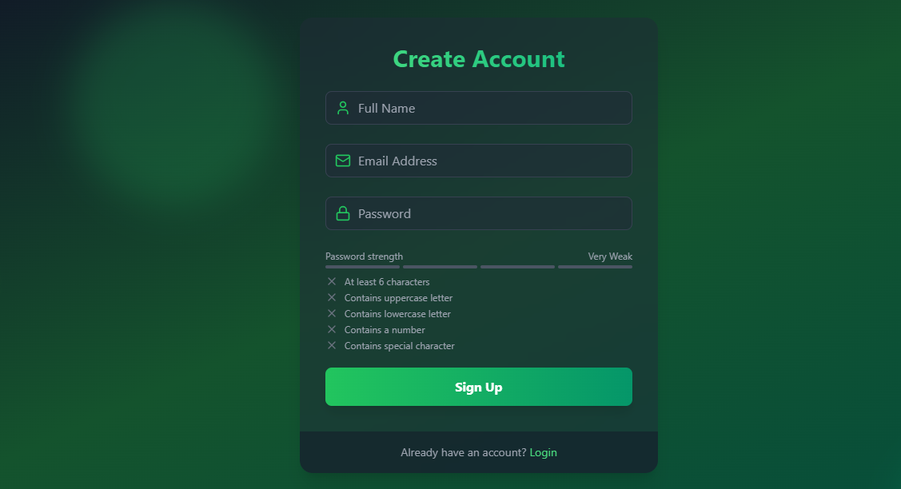
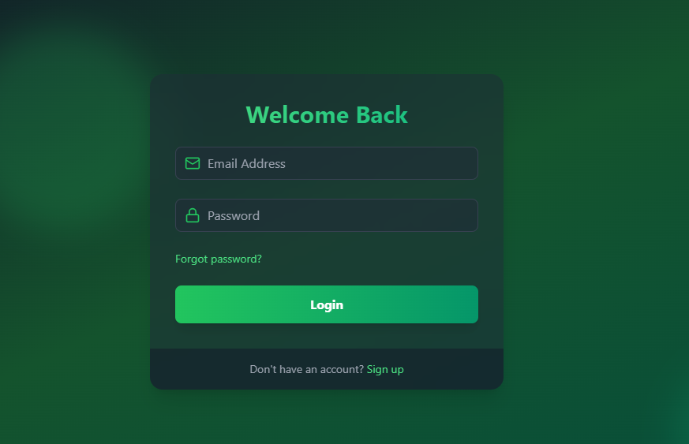
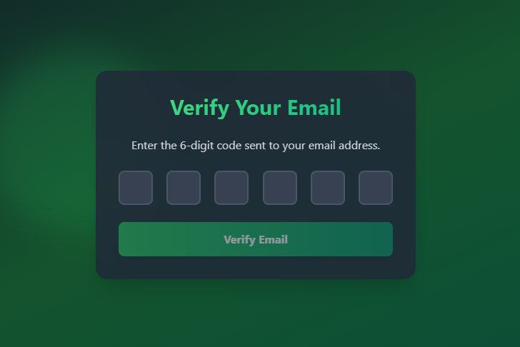
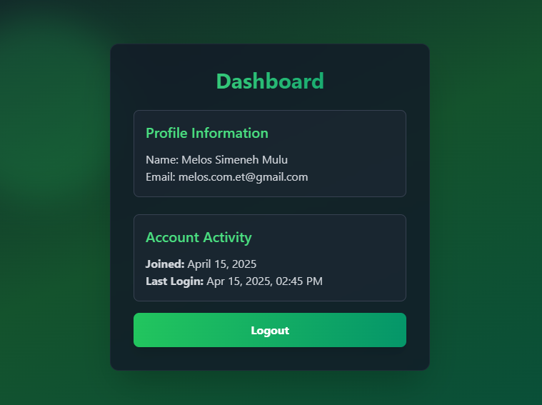

# 🔐 Advanced MERN Authentication App

A full-stack authentication system built with **MongoDB**, **Express**, **React**, and **Node.js**. This app supports robust features like **JWT-based auth**, **email verification**, **password reset**, and **protected routes**.

## 🚀 Live Demo

🌐 Try the live version here: [https://advanced-mern-auth-j46a.onrender.com/](https://advanced-mern-auth-j46a.onrender.com/)

## 📸 Screenshots

**📝 Sign Up Page**


**🔐 Login Page**  


**📧 Email Verification**  


**📧 Home Page**  


## ✨ Features

- ✅ User Registration & Login

- 🔐 JWT-based Authentication

- 📧 Email Verification Flow

- 🔑 Forgot/Reset Password

- 🚫 Logout & Token Expiry Handling

- 🚀 Fully Protected Routes

- 🔁 Persistent Sessions with Auto-check

- 📱 Responsive UI with TailwindCSS + daisy ui + React

## 🛠️ Tech Stack

**Frontend:**

- React
- React Router
- Zustand (Global State)
- TailwindCSS + daisy ui
- React Hot Toast

**Backend:**

- Node.js
- Express.js
- MongoDB (Mongoose)
- JWT
- Bcrypt
- Nodemailer

## 📁 Project Structure

```bash
advanced-mern-auth/
├── backend/          # Express REST API
│   ├── controllers/  # Logic for auth flows
│   ├── models/       # Mongoose schemas
│   ├── routes/       # Auth API endpoints
│   ├── middlewares/  # Token verification
│   └── utils/        # Email service, tokens, etc.
├── frontend/         # React + Zustand + Tailwind
│   ├── pages/        # Route components
│   ├── components/   # Reusable UI
│   ├── store/        # Auth state management
│   └── App.jsx       # App routing and layout
└── package.json      # Project scripts
```

## ⚙️ Installation

### 1. Clone the Repository

```bash
git clone https://github.com/melos-simeneh/advanced-mern-auth.git
cd advanced-mern-auth
```

### 2. Backend Setup

```bash
cd backend
npm install
```

Create a .env file in the backend folder:

```ini
NODE_ENV=development
PORT=5000
CLIENT_URL=http://localhost:5173
MONGO_DB_URL=mongodb://localhost:27017/auth_db
JWT_SECRET=melos_jwt_secret_key
EMAIL_USERNAME=melos@example.com
EMAIL_PASSWORD=fdsdg
EMAIL_FROM_NAME=MERN Auth
```

Start the backend server:

```bash
npm run dev
```

The backend server  will be available at [http://localhost:5000](http://localhost:5000)

### 3. Frontend Setup

```bash
cd ../frontend
npm install
```

Start the React development server:

```bash
npm run dev
```

Frontend will be running at: [http://localhost:5173](http://localhost:5173)

### ⚙️ Other way to run the app

Local Development

```bash
# Install dependencies and start both frontend and backend
npm install
npm run start
```

This will start the backend server using the backend/start script.

Build for Production

```bash
npm run build
```

This installs all dependencies in both frontend and backend and builds the React app.

## 🔌 How it Works

- Users can **sign up** and must **verify their email** before accessing protected content.

- A **JWT token** is used to authenticate the user on the frontend and backend.

- Auth state is managed using Zustand for seamless session persistence.

- Password reset uses a **tokenized email link** for security.

- Protected routes use React Router to prevent unauthorized access.

- Auto-auth check on app load ensures valid sessions.

## 🔒 API Endpoints

- **POST** `/api/auth/signup` – Create user
- **POST** `/api/auth/login` – Log in user
- **POST** `/api/auth/logout` – Log out user
- **POST** `/api/auth/verify-email` – Verify email
- **POST** `/api/auth/forgot-password` – Request password reset
- **POST** `/api/auth/reset-password/:token` – Reset password
- **GET** `/api/auth/check-auth` – Validate user session

## 📧 Contact

Made with 💚 by **MELOS**
📬 For issues, suggestions, or contributions, feel free to open an issue.
